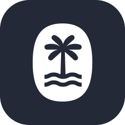
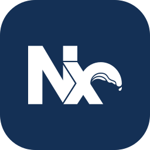
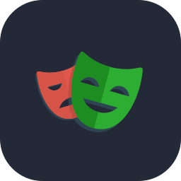
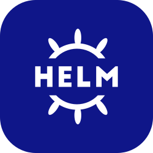
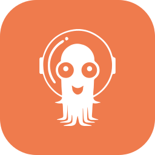
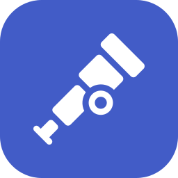

<!-- Hero -->
<picture>
  <source media="(max-width: 600px)" srcset="https://capsule-render.vercel.app/api?type=waving&color=0:FF7900%2C100:D97757&section=header&text=%C2%A1Hola!%20I'm%20Andr%C3%A9s&fontColor=ffffff&animation=fadeIn&desc=Frontend%20Chapter%20Lead%20%C2%B7%20AI-augmented%20engineering&height=260&fontSize=84&fontAlignY=36&descSize=32&descAlignY=62">
  
</picture>

  

  
  
  
  
  

## 👋 About me

- 🧭 **Frontend Chapter Lead at MasOrange** (Madrid) — I help several product teams ship from one big Nx meta-monorepo: 5 independent workspaces, React 17→19, Next.js, Vite, Astro & friends, all the way to GKE
- 🤖 Currently all-in on **AI-augmented engineering** — specs, skills and agents baked into how we work every day, and getting more **agentic** by the sprint (more below 👇)
- 🥑 Trying hard to be a great teammate: mentoring, DX and docs are features too
- ⚡ Fun fact: some days our monorepo talks to more AI agents than humans 😄

## 🤖 How we build with AI

AI isn't a side project for us — it's wired into the whole delivery loop, from the first idea to the merged PR.

And we say **AI-augmented** on purpose: the AI amplifies the engineer, never the other way around. As our loops grow more **agentic** — agents that plan, execute and verify their own work — exactly two things stay non-negotiably human: **intent** (what to build and why) and **review** (what actually ships).

  
  
  
  
  
  

| Stage | What we do | Powered by |
|:-----:|------------|------------|
| 🧠 **Shape** | Spec-driven development: proposal → specs → design → tasks, humans and agents working from the same source of truth | OpenSpec + Jira |
| 🏗️ **Build** | Agent-ready codebase: `AGENTS.md` guides everywhere + **40+ reusable agent skills** shared across our harnesses | oh-my-pi · opencode · Claude Code |
| 🔌 **Connect** | Agents reach live docs, the browser, Slack and Jira through MCP servers | Model Context Protocol |
| 👀 **Review** | Team-aware AI code review on every PR — each team gets rules tuned to its own code | Claude in GitHub Actions |
| 📚 **Learn** | Skills as living knowledge: curated, versioned and shared — never locked into one vendor | [skills-manager](https://github.com/pateroski/skills-manager) (my OSS) |
| 🔁 **Evolve** | Building loops that keep getting **more efficient and self-verifiable** — agents prove their own work before humans polish it | Us, always in the loop |

<b>🧰 Peek inside the AI toolbox</b>

 

- **Spec workflow skills** — propose, design, verify and archive changes without losing the paper trail
- **Docs automation** — TechDocs, ADRs, runbooks and catalog entries generated and kept honest by agents
- **Guardrail skills** — AI code review rules, writing de-slop, guided learning (`guide-me`, `quiz-me`) so the humans keep growing too
- **[skills-manager](https://github.com/pateroski/skills-manager)** — my own open-source CLI to install, update and track agent skills across harnesses, privacy-first 🔒

> 💡 My take: **AI is a force multiplier, not an autopilot** — specs first, self-verifying loops, and **intent & review are never delegated**. 🧡

## 🛠️ Tech I work with daily

  <b>⚛️ Frontend at scale</b>  
  
  

  <b>🧰 Monorepo & tooling</b>  
  
  

  <b>🧪 Testing & quality</b>  
  
  

  <b>🚢 Platform & delivery</b>  
  
  
  

  <b>📡 Observability</b>  
  
  
  

## 📈 GitHub activity

  <picture>
    <source media="(prefers-color-scheme: dark)" srcset="https://streak-stats.demolab.com?user=pateroski&theme=github-dark-blue&hide_border=true">
    <source media="(prefers-color-scheme: light)" srcset="https://streak-stats.demolab.com?user=pateroski&hide_border=true">
    
  </picture>

## 📫 Let's connect

Always happy to talk **frontend at scale**, **AI-augmented workflows** or **self-verifying agent loops** — say hi on [LinkedIn](https://www.linkedin.com/in/andresreyesnavas/) 👋

